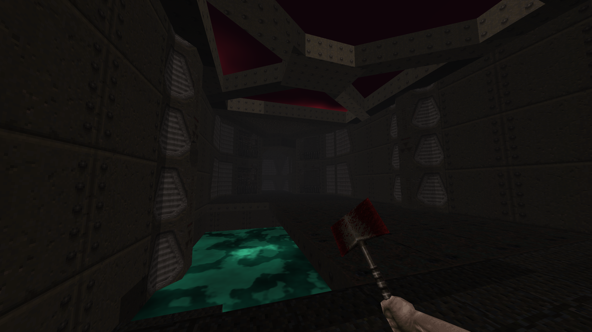

# go-quake

Minimalistic Quake 1 engine written in Go. Loads real BSP29 maps and renders them with a compute shader PVS pipeline.



## Requirements

- Go 1.21+
- OpenGL 4.3
- A Quake 1 installation (for PAK file) or a loose `.bsp` file

## Running

```bash
# Load map from a Quake 1 PAK file
go run . -pak /path/to/id1/pak0.pak -map e1m1

# List all maps in a PAK
go run . -pak /path/to/id1/pak0.pak

# Load a standalone .bsp file (no textures or weapon)
go run . -map /path/to/e1m1.bsp
```

## Controls

| Key | Action |
|-----|--------|
| WASD | Move |
| Mouse | Look |
| Space | Jump |
| Escape | Quit |

## Features

- **Compute shader PVS** — Quake's portal visibility executed on the GPU; invisible faces are discarded before rasterization
- **Goroutine architecture** — input, physics, and rendering run as separate goroutines communicating over typed channels; vsync is the only throttle
- **BSP collision** — hull tracing against the world and brush entities (func_door, func_plat)
- **Interactive doors and elevators** — proximity-triggered state machines with full collision
- **Procedural skybox** — FBM cloud layers replace Quake sky polygons; no seams from any angle
- **Procedural water** — sin-warp turbulence + caustic glints replace Quake water textures
- **View weapon** — `v_axe.mdl` parsed from the PAK and rendered in camera space
- **Item pickup** — weapons, armor, ammo, health, and keys disappear on contact (32-unit radius, single-player rules)
- **Monster entities** — all 15 Quake monster types parsed and rendered as static MDL models at spawn positions

## License

This project is for educational purposes. Quake 1 game data (PAK files) is not included and remains property of id Software.
