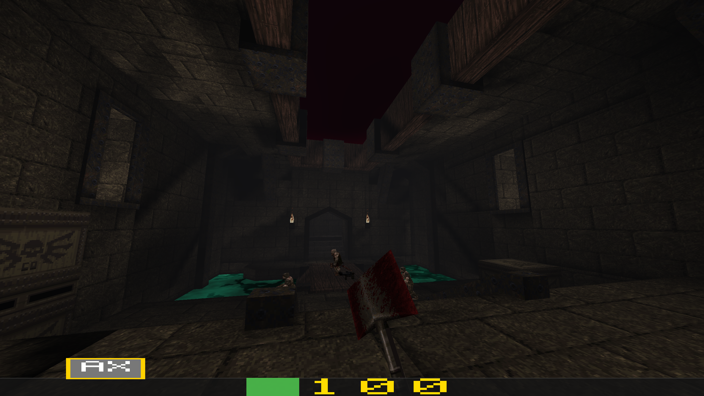

# go-quake

Minimalistic Quake 1 engine written in Go. Loads real BSP29 maps and renders them with a compute shader PVS pipeline.



## Requirements

- Go 1.21+
- OpenGL 4.3
- OpenAL (`libopenal` — `apt install libopenal-dev` or equivalent)
- A Quake 1 installation (for PAK file) or a loose `.bsp` file

## Running

```bash
# Load map from a Quake 1 PAK file
go run . -pak /path/to/id1/pak0.pak -map e1m1

# List all maps in a PAK
go run . -pak /path/to/id1/pak0.pak

# Load a standalone .bsp file (no textures or weapon)
go run . -map /path/to/e1m1.bsp
```

## Controls

| Key / Button | Action |
|---|---|
| WASD | Move |
| Mouse | Look |
| Space | Jump |
| Left mouse button | Attack (axe swing / shoot) |
| Escape | Quit |
| F12 | Screenshot |

## Features

- **Compute shader PVS** — Quake's portal visibility executed on the GPU; invisible faces are discarded before rasterization
- **Lightmap atlas** — all per-face baked lightmaps packed into a GPU atlas texture; sampled per-pixel for smooth spatial lighting gradients matching GLQuake
- **Goroutine architecture** — input, physics, and rendering run as separate goroutines communicating over typed channels; vsync is the only throttle
- **BSP collision** — hull tracing against the world and brush entities (func_door, func_plat)
- **Interactive doors and elevators** — proximity-triggered state machines with full collision
- **Procedural skybox** — FBM cloud layers replace Quake sky polygons; no seams from any angle
- **Procedural water** — sin-warp turbulence + caustic glints replace Quake water textures; screen-space blue-green tint overlay when submerged
- **View weapon** — `v_axe.mdl` rendered in camera space with full swing animation and weapon bob
- **View bob & camera roll** — camera bobs vertically (±2 units) and horizontally (±1 unit) at speed-scaled frequency when moving on ground; camera tilts up to 4° when strafing (smoothed via exponential decay); weapon bob tracks view bob at 1.5× vertical / 1.2× horizontal amplitude
- **Item pickup** — weapons, armor, ammo, health, and keys disappear on contact; health packs restore HP; armor items grant armor points that absorb a fraction of incoming damage (green 30%, yellow 60%, red 80%)
- **Item rotation** — world items (weapons, armor) spin continuously around their Z axis at 1.8 rad/s
- **Flame entities** — `light_flame_*` classnames parsed and rendered as animated `flame2.mdl`; purely decorative, no AI or collision
- **Monster AI** — all 15 Quake monster types animate, alert on line-of-sight, chase, and melee attack; blocked by closed doors; subject to gravity
- **Blood particles** — axe and bullet hits spray 150 physics-simulated particles in a wide cone; particles arc with gravity, splat on walls and floors, then fade out; when the pool fills with stuck decals, new flying particles evict the lowest-life decals
- **Wall sparks** — hitscan rounds striking BSP geometry spray 12 orange spark particles per pellet; sparks arc under gravity and fade as stuck decals
- **Bullet tracers** — each hitscan pellet leaves a brief bright yellow-white line from the weapon muzzle to the impact point; pool of 128, 50 ms lifetime, additively blended
- **Combat** — left-click attacks with the active weapon: axe (melee swing, hit at frame 2), shotgun/super shotgun (hitscan pellets with spread), nailgun/super nailgun (full-auto hitscan), rocket/grenade launcher, lightning gun; weapons switched with keys 1–8
- **Player health & armor** — starts at 100 HP; armor absorbs damage before health; HUD shows health (green→red), armor (gold, center), and ammo (blue) bars; death teleports back to spawn
- **Respawn** — on death the player resets to spawn, HP restores to 100, and all monsters un-alert
- **Sound** — OpenAL audio for weapon fire (axe swing/hit, all 7 hitscan weapons), item pickup, and per-monster death cries; 16-source pool; missing sounds silently skipped

## License

This project is for educational purposes. Quake 1 game data (PAK files) is not included and remains property of id Software.
